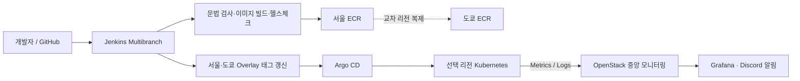

# Endive Cloud — 멀티 리전 DR 및 DevOps 포트폴리오

서울 리전을 기본 운영 환경으로 사용하고, 리전 장애 시 도쿄 리전으로 서비스를 복구하는 팀 프로젝트에서 제가 담당한 **CI/CD, GitOps, 통합 모니터링, 복구 자동화 연동**을 정리한 포트폴리오입니다.

> 이 저장소는 구현 결과를 설명하기 위해 재구성한 개인 포트폴리오입니다. 운영 Secret, 토큰, 계정 번호, 사설 IP는 포함하지 않습니다.

## 한눈에 보기

| 구분 | 담당 내용 | 사용 기술 |
|---|---|---|
| CI | 4개 저장소의 Multibranch 검증, 서비스 이미지 빌드·헬스체크·Push | Jenkins, Docker, AWS ECR |
| CD | 이미지 태그의 GitOps 반영, 서울·도쿄 Application 선언 및 자동 동기화 | Argo CD, Kustomize, GitHub |
| 모니터링 | OpenStack 중앙 서버에서 AWS 클러스터의 메트릭·로그 통합 관제 | Prometheus, Alloy, Loki, Grafana |
| 알림 | 노드·Kubernetes 상태 규칙과 Discord 알림 흐름 구성 | Alertmanager, PrometheusRule |
| DR 연동 | 모니터링, 저장소 인증, 앱 Secret, 리전별 Application 복구 구성 | Ansible, Tailscale, Kubernetes |

## 문제와 해결

### 1. 개발 브랜치와 운영 배포의 책임 분리

- 모든 브랜치는 소스 문법과 필수 파일을 검증합니다.
- `main`만 Docker 이미지를 ECR에 Push하고 GitOps 태그를 변경합니다.
- GitOps 전용 커밋은 다시 이미지를 만들지 않도록 순환 빌드를 방지했습니다.

### 2. 배포 상태를 Git으로 단일화

- Kubernetes 매니페스트를 서비스 저장소에서 관리하도록 정리했습니다.
- 공통 `base`와 서울·도쿄 `overlay`를 분리했습니다.
- Argo CD의 자동 동기화, Prune, Self Heal로 Git 상태와 클러스터 상태를 일치시켰습니다.

### 3. 분산 환경을 하나의 관제 화면으로 통합

- AWS Kubernetes의 메트릭은 Prometheus `remote_write`로 중앙 서버에 전송합니다.
- 노드·파드 로그는 Alloy DaemonSet이 수집해 중앙 Loki로 전송합니다.
- 서울·도쿄 대시보드를 분리하고 IP 대신 노드 이름이 보이도록 라벨을 정리했습니다.

### 4. 재구축 후 운영 구성까지 자동 복구

- Ansible에서 모니터링과 로깅을 리전별 values로 설치하도록 구성했습니다.
- Argo CD 저장소 인증, 애플리케이션 Secret, 리전별 Application을 복구 순서에 포함했습니다.
- 실제 Secret 값은 Git이 아닌 기존 Ansible Vault 변수를 참조하도록 분리했습니다.

## 문서 구성

- [CI/CD와 GitOps 구현](docs/cicd-gitops.md)
- [통합 모니터링과 알림](docs/monitoring-logging.md)
- [DR 복구 자동화 연동](docs/dr-automation.md)
- [문제 해결 기록](docs/troubleshooting.md)
- [개인 기여 범위와 근거](docs/project-contribution-scope.md)
- [민감정보를 제거한 설정 예시](examples/README.md)

## 프로젝트 저장소

- [endive-service](https://github.com/ktcloud4-endive/endive-service): 애플리케이션, 서비스 CI, Kubernetes GitOps
- [endive-platform](https://github.com/ktcloud4-endive/endive-platform): CD 선언, 중앙 모니터링, 대시보드·알림
- [endive-infra](https://github.com/ktcloud4-endive/endive-infra): Terraform·Ansible 인프라 자동화
- [endive-docs](https://github.com/ktcloud4-endive/endive-docs): 팀 문서와 문서 CI

## 담당 범위 안내

이 포트폴리오는 팀 전체 결과가 아니라 제가 직접 구현하거나 주도적으로 연동한 부분만 다룹니다. Terraform 기반 인프라 생성, Kubernetes 기본 클러스터 설치, 데이터베이스 백업·복구, 애플리케이션 비즈니스 로직은 팀원의 담당 결과이며, 저는 그 위에서 동작하는 CI/CD·관제·복구 구성의 연결을 담당했습니다.
