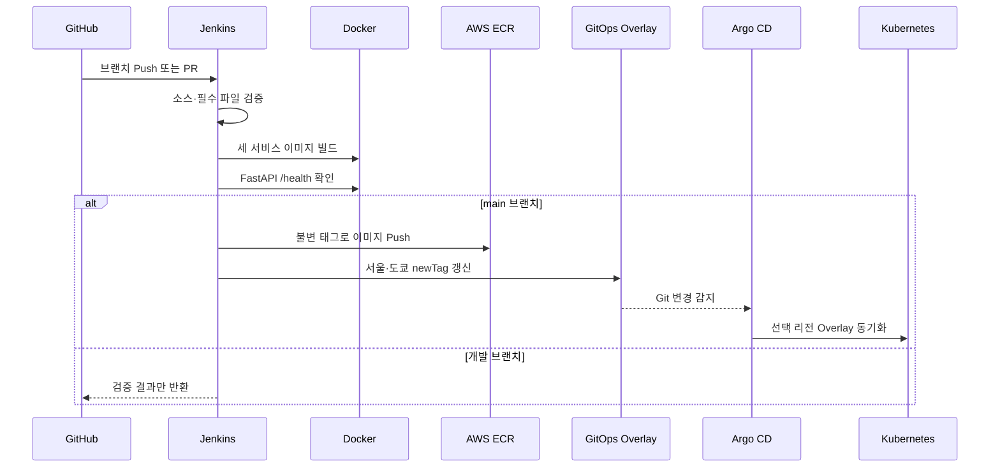

# CI/CD와 GitOps 구현

## 설계 목표

개발 브랜치는 빠르게 검증하고, 운영 배포는 `main`에 병합된 코드만 대상으로 수행하도록 분리했습니다. 배포 명령을 Jenkins가 클러스터에 직접 실행하지 않고, GitOps 저장소의 이미지 태그를 변경하면 Argo CD가 선언된 상태를 적용하게 했습니다.

## 저장소별 CI

| 저장소 | Jenkins 검증 내용 | 운영 반영 |
|---|---|---|
| `endive-service` | Python 문법, 필수 파일, Docker 빌드, FastAPI 헬스체크 | `main`만 세 이미지 ECR Push 및 GitOps 태그 갱신 |
| `endive-platform` | 민감 파일, YAML·Grafana JSON, Docker Compose 문법 | 설정 변경의 병합 전 검증 |
| `endive-infra` | YAML, Ansible playbook, Vault 형식 등 인프라 코드 검증 | 검증된 자동화 코드만 병합 |
| `endive-docs` | Markdown 존재 여부와 충돌 마커 검사 | 문서 품질 확인 |

## 서비스 파이프라인 흐름

### 주요 설계 포인트

1. **불변 이미지 태그**
   Jenkins 빌드 번호와 짧은 커밋 해시를 조합하여 어떤 소스가 배포되었는지 추적할 수 있게 했습니다.

2. **배포 루프 방지**
   Jenkins가 태그 갱신용 커밋을 만들면 다음 빌드에서는 GitOps 전용 변경으로 판별하여 이미지 빌드와 Push를 생략합니다.

3. **빌드 중 main 변경 보호**
   빌드 시작 후 `main`이 바뀌면 이전 이미지의 태그 갱신을 생략하여 최신 소스보다 오래된 이미지가 배포되는 상황을 막습니다.

4. **리전별 Overlay**
   공통 리소스는 `base`에 두고 ECR 경로와 리전 라벨은 서울·도쿄 Overlay에서 관리합니다. Jenkins는 두 Overlay의 세 이미지 태그를 같은 버전으로 갱신합니다.

5. **Argo CD 자동 복구**
   자동 Sync, Prune, Self Heal과 재시도를 적용하여 수동 변경을 Git 상태로 되돌리고, 삭제된 리소스도 정리합니다.

## 배포와 롤백

- 배포: 애플리케이션 코드를 `main`에 병합하면 Jenkins가 이미지와 GitOps 태그를 갱신하고 Argo CD가 반영합니다.
- 롤백: 문제가 발생한 태그 갱신 커밋을 `git revert`하면 Argo CD가 이전 이미지 상태로 동기화합니다.
- 도쿄 복구: Terraform·Ansible로 도쿄 클러스터가 준비되면 도쿄 Application이 기존 도쿄 Overlay를 읽어 복제된 최신 이미지를 배포합니다.

## 구현 근거

- [서비스 main 빌드·ECR Push 구성](https://github.com/ktcloud4-endive/endive-service/commit/1ea7635)
- [전체 브랜치 검증과 main Push 분리](https://github.com/ktcloud4-endive/endive-service/commit/fa398a3)
- [GitOps 이미지 태그 자동 갱신](https://github.com/ktcloud4-endive/endive-service/commit/39f9126)
- [서비스 매니페스트를 애플리케이션 저장소로 이동](https://github.com/ktcloud4-endive/endive-service/commit/0b59fc5)
- [멀티 리전 GitOps Overlay 구성](https://github.com/ktcloud4-endive/endive-service/commit/6565c88)
- [서울·도쿄 Argo CD Application 구성](https://github.com/ktcloud4-endive/endive-platform/commit/c50defb)
