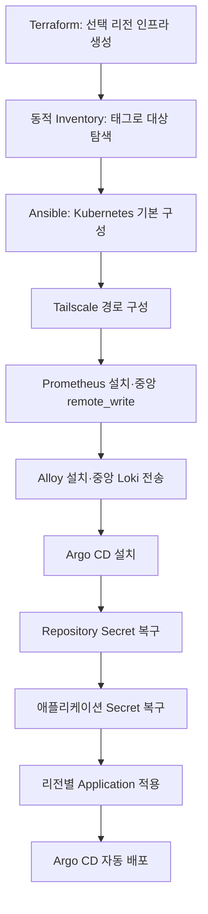

# DR 복구 자동화 연동

## 복구 목표

Terraform으로 리전 인프라를 다시 만든 뒤 Ansible 실행만으로 Kubernetes 기반 운영 구성과 애플리케이션 배포가 이어지도록 CI/CD·모니터링 영역의 복구 구성요소를 만들었습니다.

## 전체 흐름

Terraform과 Kubernetes 기본 설치는 팀원 담당입니다. 제가 구현한 범위는 모니터링·로깅 설치부터 Argo CD 인증과 Application 적용까지 이어지는 구성요소입니다.

## 복구 구성요소

| 구성요소 | 역할 | 안전 장치 |
|---|---|---|
| AWS 모니터링 | kube-prometheus-stack 설치, 리전별 values 적용 | 파드 기준 중앙 Prometheus 도달 확인, `--atomic`, timeout, 재시도 |
| AWS 로깅 | Alloy DaemonSet 설치, 리전 라벨 적용 | 중앙 Loki 도달 확인, 전체 노드 배포 수 대조 |
| Argo CD 저장소 | private GitHub Repository Secret 생성 | Vault 변수 확인, `no_log`, 표준입력 적용 |
| 앱 Secret | DB·공공데이터 API 환경변수 Secret 생성 | 리전 DB 동적 탐색, 필수 변수 검증, `no_log` |
| Argo CD Application | 서울 또는 도쿄 Application 선택 적용 | CRD 확인, 리전 라벨 검증 |

## 리전 분리 방식

- 공통 설정은 `values.yml`에 둡니다.
- 도쿄에서 달라지는 클러스터·리전 라벨만 `values-tokyo.yml`로 덮어씁니다.
- `target_region` 값으로 서울 또는 도쿄 Application 경로를 선택합니다.
- DB 주소는 고정 IP가 아니라 동적 Inventory의 리전·역할 태그를 이용해 찾습니다.

## Secret 관리

포트폴리오와 일반 YAML에는 실제 값을 저장하지 않습니다. 플레이북은 GitHub Repository 인증정보, PostgreSQL 비밀번호, 공공데이터 API 키, Tailscale OAuth 정보의 Vault 변수명만 참조합니다.

Secret 매니페스트는 `kubectl apply -f -`의 표준입력으로 전달하고, 민감 태스크에는 `no_log: true`를 적용해 파일과 실행 로그에 값이 남지 않도록 구성했습니다.

## 구현 근거

- [AWS 메트릭 중앙 전송 복구](https://github.com/ktcloud4-endive/endive-infra/commit/edbdf93)
- [AWS 로그 중앙 전송 복구](https://github.com/ktcloud4-endive/endive-infra/commit/fcbf611)
- [Argo CD Repository Secret 복구](https://github.com/ktcloud4-endive/endive-infra/commit/ce4937d)
- [애플리케이션 Secret 복구](https://github.com/ktcloud4-endive/endive-infra/commit/69d031b)
- [리전별 Argo CD Application 복구](https://github.com/ktcloud4-endive/endive-infra/commit/2de1762)
