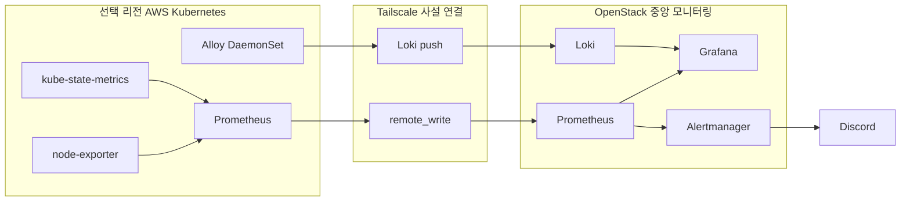

# 통합 모니터링과 알림

## 목표

OpenStack과 AWS 서울·도쿄 환경의 상태를 OpenStack 중앙 모니터링 서버에서 함께 확인하고, 장애 징후를 Discord로 전달하는 구조를 구성했습니다.

## 메트릭 수집

- AWS 클러스터의 Prometheus가 노드와 Kubernetes 오브젝트 메트릭을 수집합니다.
- `remote_write`에 `cluster`·`region` 라벨을 붙여 중앙 Prometheus로 전송합니다.
- 중앙 Grafana는 같은 쿼리 구조에 리전 라벨만 달리하여 서울·도쿄 대시보드를 제공합니다.

## 로그 수집

- Alloy를 DaemonSet으로 배포하여 모든 노드의 파드 로그를 수집합니다.
- 마스터와 taint가 있는 워커에도 배포될 수 있도록 toleration을 적용했습니다.
- 수집 로그에 클러스터·리전·네임스페이스·파드·컨테이너 라벨을 붙여 중앙 Loki로 전송합니다.
- 서울과 도쿄 로그 대시보드를 분리하여 복구 전후 환경을 명확히 구분했습니다.

## 대시보드

| 대시보드 | 주요 확인 항목 |
|---|---|
| OpenStack Endive Overview | 중앙 서버와 OpenStack 노드의 CPU·메모리·디스크·네트워크 |
| OpenStack Endive Logs | 중앙 구성요소와 컨테이너 로그 검색 |
| AWS Kubernetes 서울 Overview | 노드 수집 상태, Ready 노드, Pod, CPU·메모리, 재시작 |
| AWS Kubernetes 서울 Logs | 서울 클러스터 파드 로그 |
| AWS Kubernetes 도쿄 Overview | DR 복구 클러스터의 동일 지표 |
| AWS Kubernetes 도쿄 Logs | 도쿄 복구 환경의 파드 로그 |

## 알림

Prometheus 규칙에서 이상 상태를 감지하면 Alertmanager가 중복 알림을 묶고 Discord Webhook으로 전달합니다. 알림에는 IP 대신 운영자가 바로 식별할 수 있는 노드 이름과 리전 정보가 표시되도록 라벨을 정리했습니다.

대표 감지 항목은 다음과 같습니다.

- 노드 또는 수집 대상 Down
- CPU·메모리·디스크 사용률 임계치 초과
- Kubernetes 노드 NotReady
- Pod 비정상 상태 또는 반복 재시작
- 중앙 모니터링 구성요소 이상

## 구현 근거

- [AWS 클러스터 Prometheus 연동](https://github.com/ktcloud4-endive/endive-platform/commit/6cae92b)
- [AWS Kubernetes 대시보드 구성](https://github.com/ktcloud4-endive/endive-platform/commit/4974637)
- [노드 이름 표시 개선](https://github.com/ktcloud4-endive/endive-platform/commit/84f53da)
- [서울·도쿄 로그 대시보드 분리](https://github.com/ktcloud4-endive/endive-platform/commit/d2cc763)
- [Alertmanager 알림 구성](https://github.com/ktcloud4-endive/endive-platform/commit/a124d4c)
- [AWS 로그 중앙 전송 플레이북](https://github.com/ktcloud4-endive/endive-infra/commit/fcbf611)
